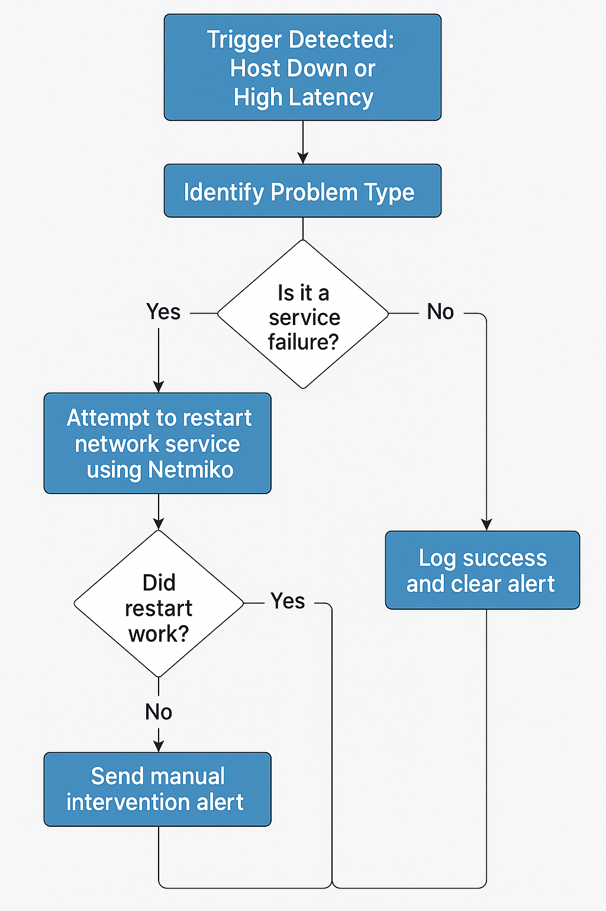

# 🚀 Automated Network Monitoring and Remediation System

A fully automated network monitoring system that detects network failures (packet loss, high latency, link failures), alerts you via Slack & Email, and performs auto-remediation using Python, Netmiko, and Shell scripts. It also provides a REST API and Prometheus-Grafana integration for real-time monitoring and dashboards.


## 📌 Features

- 📡 Pings and monitors multiple network nodes automatically
- 🔁 Detects:
  - Packet loss
  - Latency issues
  - Link down or host unreachable
- 🚨 Alerts via:
  - Slack API
  - Email (SMTP)
- 🧠 Auto-remediation:
  - Restarting network services
  - Sending commands via Netmiko
- 📊 Real-time metrics:
  - Prometheus metrics exporter
  - Grafana dashboards
- 🌐 REST API for live status of devices


## 🧾 Project File Structure

```bash
Auto-Network-Monitoring/
├── monitor.py                # Main monitoring script
├── api.py                    # Flask API to check device status
├── slack_alerts.py           # Slack webhook alert handler
├── email_alerts.py           # Email alerting script
├── remediation.sh            # Shell script to restart network services
├── requirements.txt          # Python dependencies
├── prometheus.yml            # Prometheus config
├── .gitignore                # Git ignored files
├── README.md                 # Project documentation
└── exporters/
    └── metrics_exporter.py   # Prometheus metrics exporter
```

## 🖥️ System Workflow


 ## 🔍 How Each File Works

### `monitor.py`
This script is the core monitoring engine. It performs the following actions:
* Loops over a predefined list of network devices every 60 seconds.
* Pings each device to check its reachability.
* If a device is detected as down:
    * Sends out alerts via configured channels (Slack, Email).
    * Logs the failure event for record-keeping.
    * Attempts to perform automated remediation actions using Netmiko (for network devices) or a fallback shell script.

---
### `api.py`
This file sets up a Flask web server to provide an API endpoint for checking the status of any monitored device.
**Example Request:**
To check the status of the device with IP `192.168.1.1`, you would send a GET request to `/status/192.168.1.1`.
```bash
GET /status/192.168.1.1
Example Response:

JSON

{
  "ip": "192.168.1.1",
  "status": "up"
}
```

### `slack_alerts.py`
This script is responsible for sending alert notifications to a specified Slack channel. It uses a Slack webhook URL to post messages.

### `email_alerts.py`
This script handles sending alert notifications via email. It uses a Gmail SMTP server. You will need to customize this file with your Gmail credentials (email address and an app password for security).

### `remediation.sh`
This is a shell script designed as a fallback remediation method. It attempts to restart network services like NetworkManager using `systemctl`. This script is executed if Netmiko-based remediation is not applicable or fails.

### `exporters/metrics_exporter.py`
This script exposes custom metrics in a format that Prometheus can scrape.

It runs a small HTTP server on port `8000`.
It tracks the reachability status of each device: `0` indicates the device is OK (up), and `1` indicates the device is down.

## ⚙️ Setup & Deployment

🧱 Install dependencies: Open your terminal and run the following command to install all necessary Python libraries listed in the `requirements.txt` file.
Bash

```bash

pip install -r requirements.txt
```
🛠 Configure your devices in `monitor.py`: Edit the `monitor.py` file to define the list of devices you want to monitor. Each device is a dictionary with its `host` (IP address or hostname), `username`, `password`, and `device_type`(e.g., `cisco_ios`, `juniper_junos`).

```Python
devices = [
    {"host": "192.168.1.1", "username": "admin", "password": "admin", "device_type": "cisco_ios"},
    {"host": "10.0.0.5", "username": "user", "password": "password123", "device_type": "linux"},
    # Add more devices here
]
```
🔐 Set up your credentials:
`email_alerts.py`: Open this file and enter your Gmail email address and an app password. (Using app passwords is more secure than using your main Google account password).

`slack_alerts.py`: Open this file and replace the placeholder Slack webhook URL with your actual webhook URL.

🔄 Run Monitoring Script: Start the main monitoring process by executing:

```bash
python monitor.py
```
🌐 Run API server (Optional): If you want to use the API to check device statuses, run the Flask server in a separate terminal:
```bash
python api.py
```
 ## 📈 Prometheus + Grafana Integration

This setup allows you to visualize the network monitoring data.

Prometheus Setup:
Install Prometheus: Download and install Prometheus from the official website if you haven't already.
Configure Prometheus: Replace the contents of your `prometheus.yml` configuration file with the following. This tells Prometheus to scrape metrics from the `metrics_exporter.py` script.

```yaml
scrape_configs:
  - job_name: 'network_monitor'
    static_configs:
      - targets: ['localhost:8000'] # Assumes metrics_exporter.py is running on the same machine
```
Start Prometheus: Navigate to your Prometheus directory in the terminal and start it with the new configuration:

```bash
./prometheus --config.file=prometheus.yml
```
### 📊 Grafana Setup

#### Connect Grafana to Prometheus

1. **Install Grafana** if you haven't already.
2. **Open Grafana** in your web browser: [http://localhost:3000](http://localhost:3000)
3. **Add Prometheus** as a data source, pointing it to your Prometheus server: [http://localhost:9090](http://localhost:9090)

#### Create a New Dashboard

1. In Grafana, create a **new dashboard**.
2. Add a **panel** and use a PromQL query to display the status.  
   Example to track packet loss (where `1` means down) for a specific device:

   ```promql
   network_packet_loss{device_ip="192.168.1.1"}
   ```
## 🔁 Auto-Remediation Logic

The system attempts to automatically fix issues when a device goes down.




### Netmiko (Primary Method — `monitor.py`)

For devices that support SSH access and are compatible with Netmiko (e.g., Cisco IOS, Juniper Junos), `monitor.py` can send commands like `reload` or other custom-defined commands to attempt recovery.

### Shell Script (Fallback Method)

If Netmiko is not suitable or fails, the `remediation.sh` script is executed:

```bash
bash remediation.sh
```
## 🧪 Sample Alert Output

### Slack Message

You will receive a message in your configured Slack channel similar to:

```VB.Net
ALERT: 192.168.1.2 is down or has high latency.
```

### Email Subject

Emails will have a subject line like:
```yaml
Network Alert
```


The email body will contain more details about the downed device.


## 🌐 REST API

The `api.py` script provides a simple REST API to query device status.

| Route           | Method | Description                                             |
|------------------|--------|---------------------------------------------------------|
| `/status/<ip>`   | GET    | Returns the current status (up or down) of the device. |


## 🧠 Future Improvements

Potential enhancements for this project include:

- **SNMP Trap Integration**: Receive and process SNMP traps from network devices for more proactive monitoring.
- **Web Dashboard**: Develop a dedicated web dashboard (beyond Grafana) for a live view of device statuses and logs.
- **Store Logs to Database**: Implement logging to a persistent database (e.g., PostgreSQL, MySQL, InfluxDB) for better querying and historical analysis.
- **Kubernetes & Docker Compose Deployment**: Create configurations for easier deployment and scaling using containerization technologies.


## 🙌 Contributing

Contributions are welcome!

- For **minor changes**, feel free to submit a **pull request**.
- For **major changes or new features**, please open an **issue first** to discuss the proposed changes.


## 📄 License

This project is licensed under the **MIT License**. See the `LICENSE` file for more details.


## 👨‍💻 Author

**[Shibam Nath](https://www.linkedin.com/in/nathshibam/)**  
GitHub: [shibam120302](https://github.com/shibam120302)

